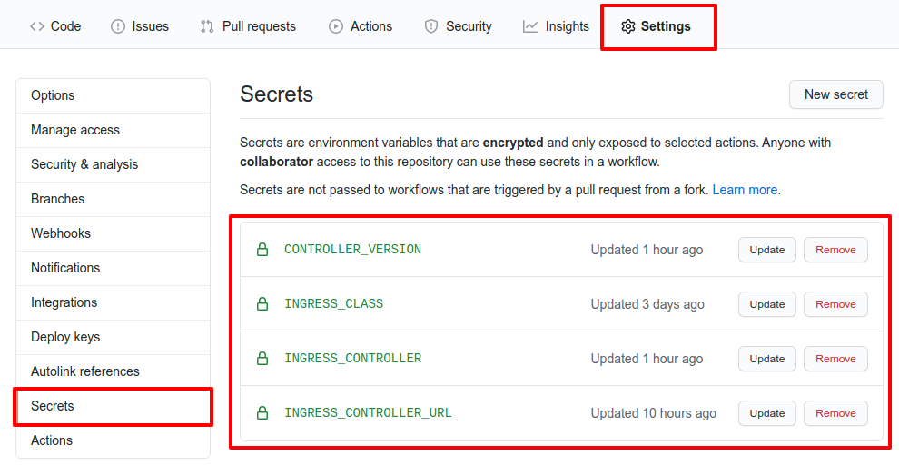

# ingress-conformance-sample

Sample repository to show how to run the conformance suite and generate reports using github pages.

### Github action jobs:

- *Prepare environment* downloads [sonobuoy](https://github.com/vmware-tanzu/sonobuoy) binary
- *Create Kubernetes cluster* using [kind](https://kind.sigs.k8s.io/)
- *Prepare cluster for testing* installs an ingress controller
- *Run conformance tests* using `sonobuoy run` and waits until finishes
- *Generate reports* extracts cucumber json files from `sonobuoy retrieve` output and generates static html files

**Website:** https://aledbf.github.io/ingress-conformance-sample/

### How I run the conformance test using a particular ingress controller?

- Fork the repository -> **Click Settings** -> **Click Secrets**
- Change secrets `INGRESS_CLASS` and `INGRESS_CONTROLLER_URL` values

where:

- **INGRESS_CLASS:** name of the class that are valid for the ingress controller
- **INGRESS_CONTROLLER_URL:** URL that will be used to install the ingress controller running `kubectl apply -f <URL>`
